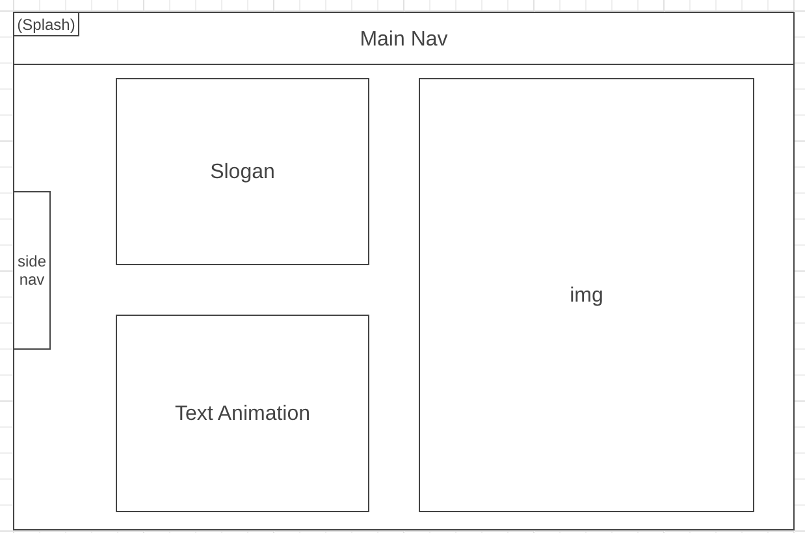
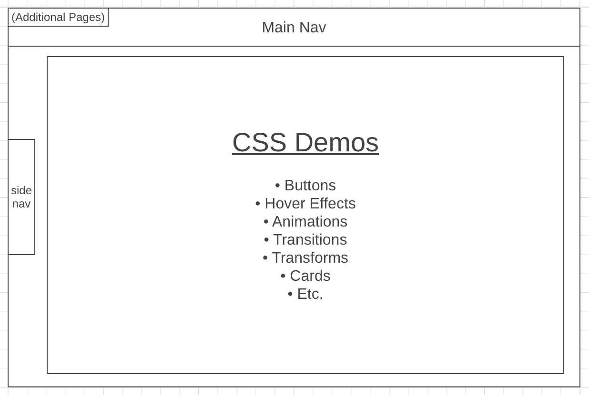

# Tricks.css

[Tricks.css](https://trieutrue.github.io/tricks.css/) is a Pokemon themed application with interactive CSS demos that shows off DOM manipulations, CSS3 animations, and basic JavaScript to handle the interaction. This frontend demo shows my skills using only JavaScript, CSS, and HTML5, imitating React's seamless DOM manipulation.


## Technologies
* JavaScript
* CSS Transitions, Transforms and Animations
* HTML5
* Fetch API
* Webpack
* [Pokémon TCG API](https://pokemontcg.io/) by [Andrew Backes](https://andrewbackes.com/)

## Featured Demo
### Card animations
When designing Tricks.css, I wanted to use an API to draw data from and was happy to find the Pokémon TCG API that has enabled me to mess around with the JSON data I receive. Although the API has a plethora of data, I am currently using the API as a photo libray to animate cards to flip and slide. This card animation can be used for many things, such as a carosel of articles, or a gallery of photos. In future version, I hope to implement unique interactions with the data to create something fun for all Pokémon card collectors.
```javascript
const toggleTransform = e => {
  const { firstElementChild } = e.currentTarget
  if (!firstElementChild.style.transform) {
    firstElementChild.style.transform = "rotateY(-180deg)"
  } else {
    firstElementChild.style.transform = ""
  }
}


const moveCards = e => {
  const order = parseInt(e.currentTarget.dataset["order"]) + 1;
  const cards = document.getElementsByClassName('card-flip');

  for (let i = order; i < cards.length - 1; i++) {
    const card = cards[i];
    let left = parseInt(card.style.left.slice(0, -2))
    if (e.type === "mouseout") {
      card.animate({ left: [`${left}px`, `${left-100}px`], easing: "ease-in-out"})
    }
    if (e.type === "mouseover") {
      card.animate({ left: [`${left}px`, `${left + 100}px`], easing: "ease-in-out" })
    }
  }
}
```
## Wireframes


